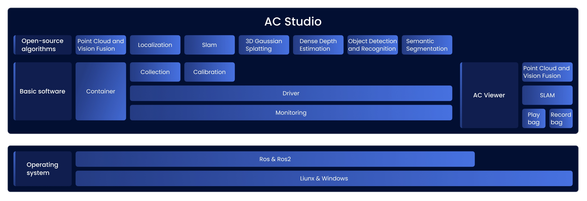

# Introduction to AC Studio
AC Studio is a one-stop toolkit for developers, designed to simplify development, accelerate algorithm implementation, and maximize the performance of AC series hardware. 

It includes AC Viewer, a cross-platform plug-and-play software for visualizing sensor data and performing basic functions; basic software with tools like drivers, data acquisition, monitoring, and calibration to reduce development complexity; and open-source algorithms that showcase advanced capabilities on AC sensors, demonstrating their potential in various applications.

