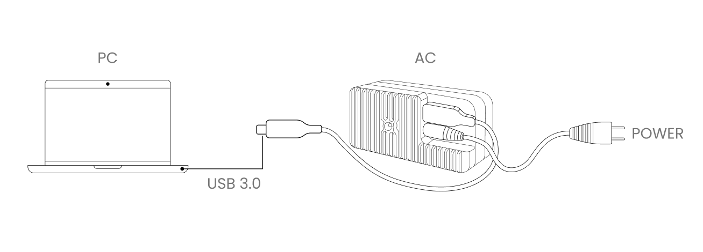

# AC Viewer  

AC Viewer is a software designed specifically for Active Camera, which can be used to display real-time data (including point clouds, images, etc.) from all Active Cameras connected to the computer. 

Through AC Viewer, users can easily view, record, and store sensor data for later use.

**Hardware preparation:**
- Active Camera x 1
- power cable
- data cable
- PC x 1  

**PC configuration:**

<table class="docutils align-default" style="width: 100%;">
    <tbody>
        <tr class="row-even centered-table-text">
            <td></td>
            <td style="font-weight: bold;">Minimum Requirements</td>
            <td style="font-weight: bold;">Recommended configuration</td>
        </tr>
        <tr class="row-odd centered-table-text">
            <td>CPU</td>
            <td>7th Gen Intel Core i3 or equivalent</td>
            <td>Intel 11500 or above   Mac M2 or above</td>
        </tr>
        <tr class="row-even centered-table-text">
            <td>GPU</td>
            <td>Integrated graphics</td>
            <td>NVIDIA RTX 3060 or higher</td>
        </tr>
        <tr class="row-odd centered-table-text">
            <td>RAM</td>
            <td>8GB</td>
            <td>16GB or more</td>
        </tr>
        <tr class="row-even centered-table-text">
            <td>Connectivity</td>
            <td>USB3.0</td>
            <td>USB3.0</td>
        </tr>
    </tbody>
</table>

**Supported Operating Systems:**
- windows 10 x64   
- Ubuntu 20.04 x64  
- Mac OS 11 or higher M1/2/Intel

**Physical connection:**
  

**Software preparation:**  
[AC Viewer version 1.0.6 (64 bit) - Ubuntu 20.04](https://cdn.robosense.cn/AC_wiki/AcViewer_Linux_x86_64_release_1.0.6.zip)  
[AC Viewer version 1.0.6 (64 bit) - windows 10](https://cdn.robosense.cn/AC_wiki/AcViewer_Win_x86_64_release_1.0.6.zip)

**Software Usage:**
- Check if the device is properly connected and if the data stream is normal

    <iframe src="https://cdn.robosense.cn/AC_wiki/acview_check_en.mp4" allowfullscreen style="position:absolute; top:0; left:0; width:100%; height:100%;"></iframe>

- Recording

    <iframe src="https://cdn.robosense.cn/AC_wiki/acview_collect_en.mp4" allowfullscreen style="position:absolute; top:0; left:0; width:100%; height:100%;"></iframe>

- Playback

    <iframe src="https://cdn.robosense.cn/AC_wiki/acview_replay_en.mp4" allowfullscreen style="position:absolute; top:0; left:0; width:100%; height:100%;"></iframe>

- Offline SLAM

    <iframe src="https://cdn.robosense.cn/AC_wiki/acview_slam_en.mp4" allowfullscreen style="position:absolute; top:0; left:0; width:100%; height:100%;"></iframe>

