# AC Viewer  

AC Viewer is a software designed specifically for Active Camera, which can be used to display real-time data (including point clouds, images, etc.) from all Active Cameras connected to the computer.  
Through AC Viewer, users can easily view, record, and store sensor data for later use.

Please download the software version corresponding to your hardware model:
- For AC1, Download V1.0
- For AC2, Download V2.0. 

## v1.0 User Guide

**Hardware preparation:**
- Active Camera x 1
- power cable
- data cable
- PC x 1  


**PC configuration:**
<table class="docutils align-default" style="width: 100%;">
    <tbody>
        <tr class="row-even centered-table-text">
            <td></td>
            <td style="font-weight: bold;">Minimum Requirements</td>
            <td style="font-weight: bold;">Recommended configuration</td>
        </tr>
        <tr class="row-odd centered-table-text">
            <td>CPU</td>
            <td>7th Gen Intel Core i3 or equivalent</td>
            <td>Intel 11500 or above <br> Mac M2 or above</td>
        </tr>
        <tr class="row-even centered-table-text">
            <td>GPU</td>
            <td>Integrated graphics</td>
            <td>NVIDIA RTX 3060 or higher</td>
        </tr>
        <tr class="row-odd centered-table-text">
            <td>RAM</td>
            <td>8GB</td>
            <td>16GB or more</td>
        </tr>
        <tr class="row-even centered-table-text">
            <td>Connectivity</td>
            <td>USB3.0</td>
            <td>USB3.0</td>
        </tr>
    </tbody>
</table>


**Supported Operating Systems:**
- windows 10 x64   
- Ubuntu 20.04 x64  


**Physical connection:**
  


**Software download:**  
- [AC Viewer 1.0.11 (64 bit) - Ubuntu 20.04](https://cdn.robosense.cn/ACViewer%20Release/AcViewer_Linux_x86_64_release_1.0.11.deb)  
- [AC Viewer 1.0.11 (64 bit) - windows 10](https://cdn.robosense.cn/ACViewer%20Release/AcViewer_Win_x86_64_release_1.0.11.exe)
- [More Historical Versions](https://github.com/RoboSense-Robotics/.github/blob/main/profile/acview_download_link.md)


**Software Usage:**
- Check if the device is properly connected and if the data stream is normal
<div style="margin-bottom: 24px; position:relative; width:100%; padding-top: 55.33%;" class="video-container">
    <iframe src="https://cdn.robosense.cn/AC_wiki/acview_check_en.mp4" allowfullscreen style="position:absolute; top:0; left:0; width:100%; height:100%;"></iframe>
</div>

- Recording
<div style="margin-bottom: 24px; position:relative; width:100%; padding-top: 55.33%;" class="video-container">
    <iframe src="https://cdn.robosense.cn/AC_wiki/acview_collect_en.mp4" allowfullscreen style="position:absolute; top:0; left:0; width:100%; height:100%;"></iframe>
</div>

- Playback
<div style="margin-bottom: 24px; position:relative; width:100%; padding-top: 55.33%;" class="video-container">
    <iframe src="https://cdn.robosense.cn/AC_wiki/acview_replay_en.mp4" allowfullscreen style="position:absolute; top:0; left:0; width:100%; height:100%;"></iframe>
</div>

- Offline SLAM
<div style="margin-bottom: 24px; position:relative; width:100%; padding-top: 55.33%;" class="video-container">
    <iframe src="https://cdn.robosense.cn/AC_wiki/acview_slam_en.mp4" allowfullscreen style="position:absolute; top:0; left:0; width:100%; height:100%;"></iframe>
</div>

## v2.0 User Guide

### Installation and Startup

#### Ubuntu

1. Download the AC Viewer archive file and extract it to your home directory. 

[AcViewer_Linux_x86_64_v2.0.8_2026-02-10-16-30.zip](https://cdn.robosense.cn/ACViewer%20Release/AcViewer_Linux_x86_64_v2.0.8_2026-02-10-16-30.zip)

2. Navigate to the extracted directory and execute the following script to configure read and write permissions for AC2 (this step is only required once per host machine):

```bash
sudo bash ./Driver/AC_usb_permission.sh
```

3. (Optional) To utilize the skeleton detection algorithm, execute the following script to download the necessary model files (this step is only required once per host machine):

```bash
./setup_skeleton.sh
```

Note:
The skeleton detection algorithm has the following additional system requirements:
- An NVIDIA GPU with Volta architecture or newer.
- NVIDIA drivers installed (version 535 or higher).
- 8 to 9 GB of available disk space.

4. Once the setup is complete, launch the application by double-clicking the AcViewer.x86_64 executable, or by running the following command in the terminal:

```bash
./AcViewer.x86_64
```

#### Windows

Download the AC Viewer 2.X compressed package and extract it to any directory (not the C drive).
Note: On Windows systems, the path must not contain Chinese characters.

[AcViewer_Win_x86_64_v2.0.8_2026-02-10-16-30.zip](https://cdn.robosense.cn/ACViewer%20Release/AcViewer_Win_x86_64_v2.0.8_2026-02-10-16-30.zip)

Follow the steps below to start AC Viewer:
1. Enter the extracted directory, right-click the script below and run it as Administrator to grant read/write permissions for AC2 (this only needs to be done once per computer).

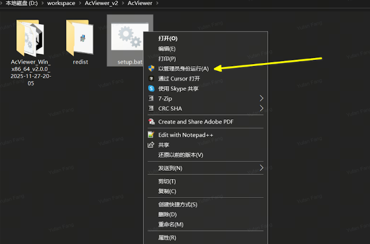

2. Open the AcViewer_Win_x86_64_v2.0.0_xxx folder and double-click AcViewer.exe to launch the program.

### Feature Usage

#### Visualization  Sensor Data and Algorithm Outputs

In the AC Viewer UI, the center area displays three main data modules. After selecting any module, thumbnails below will show the visualization results of the data contained in the selected module. Clicking a thumbnail will enlarge and display the corresponding data in the center area.

Currently, three modules are available: Basic, Depth, and Skeleton.

The Basic module includes the raw images from the left and right RGB cameras and the colorized point cloud.
In the Basic Configuration panel located in the lower-left corner, users can adjust the point size and brightness of each point in the point cloud.
Users can also select Intensity Point Cloud to display raw point cloud.

<style>
.img-text-group p:has(img) {
    margin-bottom: 0 !important;
}
.img-text-group .caption-text {
    margin-top: 1px !important;
}
</style>

<div class="img-text-group" style="display: inline-block; width: 49%; vertical-align: top;">

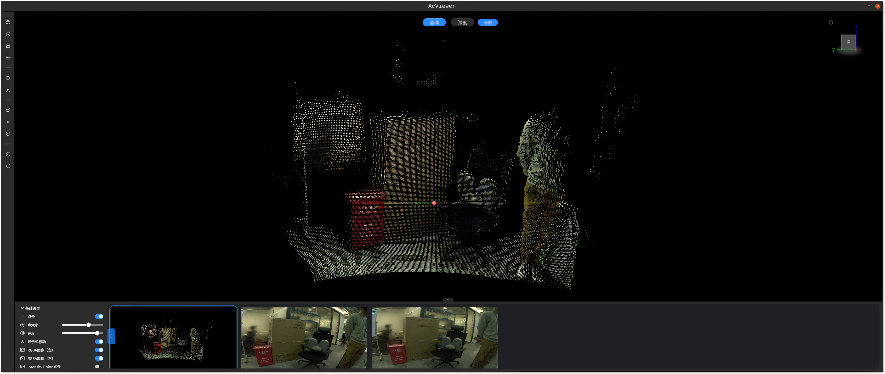

<p class="caption-text" style="text-align: center; font-size: 0.7em; color: #666;">RGB Pointcloud</p>

</div><div class="img-text-group" style="display: inline-block; width: 49%; vertical-align: top;">

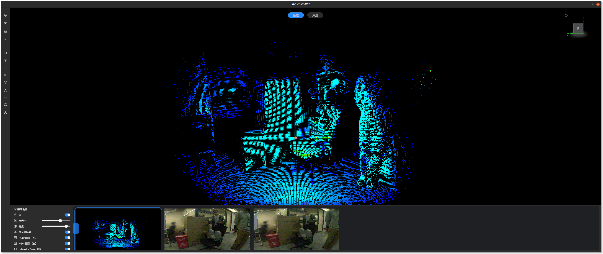

<p class="caption-text" style="text-align: center; font-size: 0.7em; color: #666;">Raw Pointcloud</p>

</div>

After selecting the Depth module, the built-in point cloud–image fusion depth estimation algorithm starts running. Additional thumbnails will appear, showing the 2D disparity map and the 3D depth estimation results.
When displaying the disparity map, users can adjust the color mapping range by dragging the Depth Range slider in the Depth Settings panel located in the lower-left corner, allowing the disparity map to achieve better visualization under the current scene.

<div class="img-text-group" style="display: inline-block; width: 49%; vertical-align: top;">

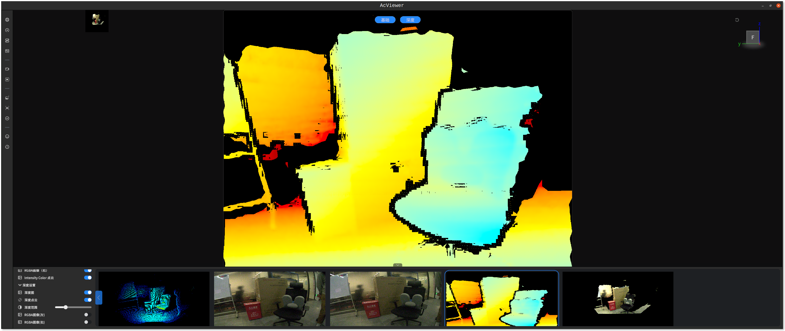

<p class="caption-text" style="text-align: center; font-size: 0.7em; color: #666;">2D Dispariy Map Visualization</p>

</div><div class="img-text-group" style="display: inline-block; width: 49%; vertical-align: top;">

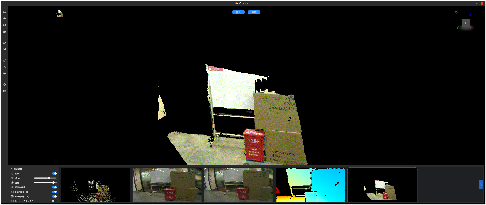

<p class="caption-text" style="text-align: center; font-size: 0.7em; color: #666;">3D depth estimation Visualization</p>

</div>

After selecting the Skeleton module, the built-in human skeleton detection algorithm based on point cloud–image fusion starts running. Additional thumbnails will appear, showing the 3D human skeletal structure and the projection of skeleton keypoints onto the 2D image.

<div class="img-text-group" style="display: inline-block; width: 49%; vertical-align: top;">

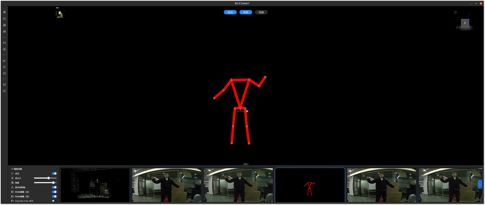

<p class="caption-text" style="text-align: center; font-size: 0.7em; color: #666;">3D Skeleton Result</p>

</div><div class="img-text-group" style="display: inline-block; width: 49%; vertical-align: top;">

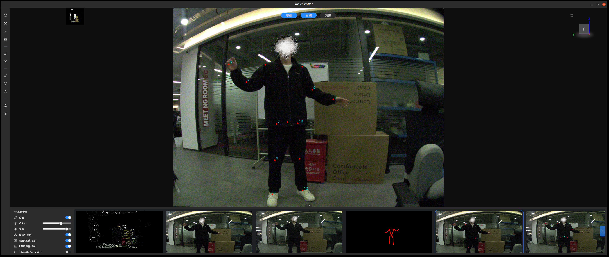

<p class="caption-text" style="text-align: center; font-size: 0.7em; color: #666;">Projection of skeleton keypoints onto the original image</p>

</div>

#### Recording and Playback of Sensor Data

##### Data Recording

Click the Record Data button on the left panel. In the pop-up dialog, select the topic names to be recorded, and edit the file prefix and save path for the output file. Then click Start Recording.
AC Viewer will save the corresponding sensor data in ROS1 bag format. The file naming convention is `<prefix>_<recording_time>.bag`

By default, recorded data is saved in the RecordData directory under the AC Viewer root directory.
After recording starts, the Record Data button on the left will flash continuously, indicating that recording is in progress. Click the button again to stop recording.

<div class="img-text-group" style="display: inline-block; width: 49%; vertical-align: top;">

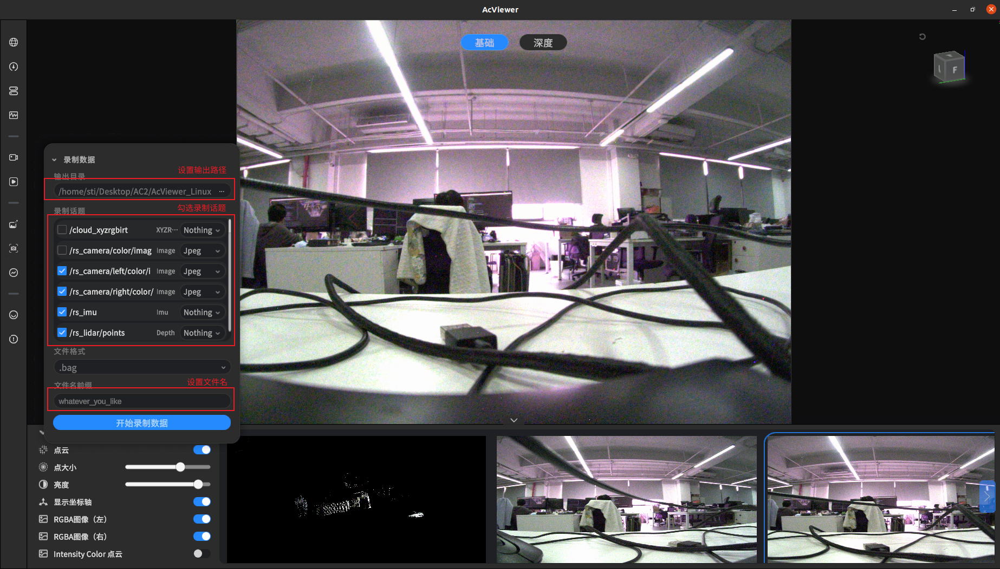

<p class="caption-text" style="text-align: center; font-size: 0.7em; color: #666;">Start Recording</p>

</div><div class="img-text-group" style="display: inline-block; width: 49%; vertical-align: top;">

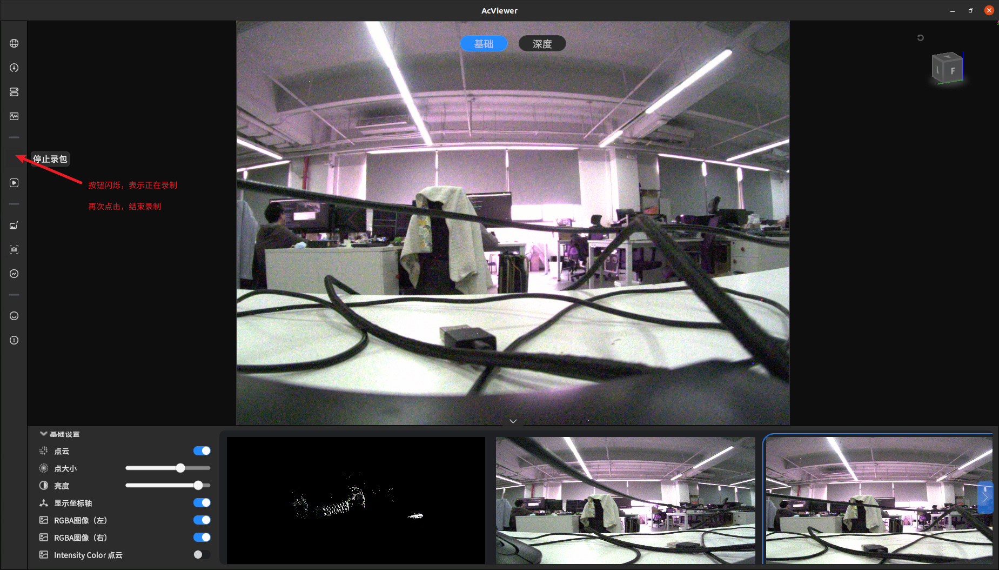

<p class="caption-text" style="text-align: center; font-size: 0.7em; color: #666;">End Recording</p>

</div>

Currently, only ROS1 bag format is supported. Support for ROS2 bag will be added in future versions.
The meanings of each topic name are as follows:

<table class="docutils align-default" style="width: 100%;">
    <tbody>
        <tr class="row-even centered-table-text">
            <td style="font-weight: bold;">Topic Name</td>
            <td style="font-weight: bold;">Meaning</td>
        </tr>
        <tr class="row-odd centered-table-text">
            <td>/rs_imu</td>
            <td>AC2 Built-in IMU Message</td>
        </tr>
        <tr class="row-odd centered-table-text">
            <td>/rs_lidar/points</td>
            <td>AC2 dToF Raw Point Cloud</td>
        </tr>
        <tr class="row-odd centered-table-text">
            <td>/rs_camera/left/color/image_raw/compressed</td>
            <td>AC2 Left Camera Compressed Image</td>
        </tr>
        <tr class="row-odd centered-table-text">
            <td>/rs_camera/right/color/image_raw/compressed</td>
            <td>AC2 Right Camera Compressed Image</td>
        </tr>
    </tbody>
</table>

##### Data Playback

Click the Playback Data button on the left panel and select the file and topics to be played back. Then click Start Playback.

A playback progress bar will appear at the bottom of the interface. Playback can be started or paused using the controls on the progress bar.

 Click the button on the far right of the progress bar to exit playback.

 <div class="img-text-group" style="display: inline-block; width: 49%; vertical-align: top;">

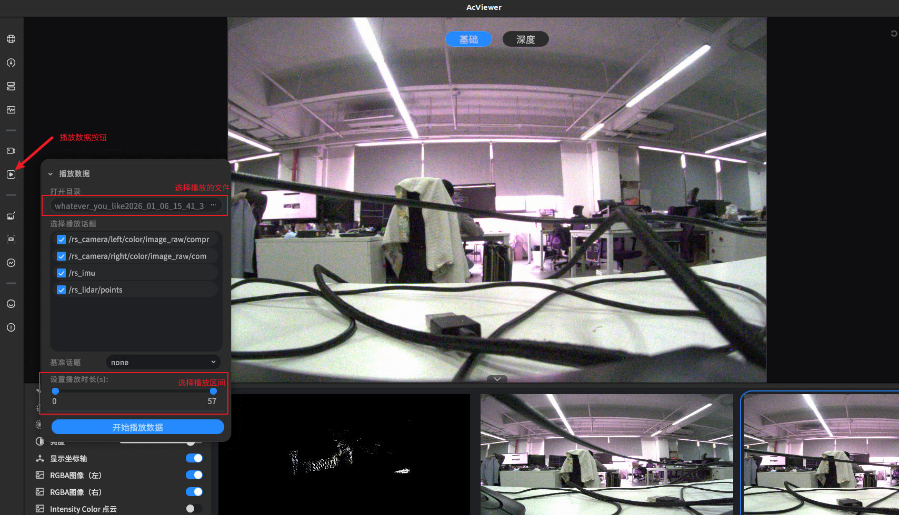

<p class="caption-text" style="text-align: center; font-size: 0.7em; color: #666;">Playback Data</p>

</div><div class="img-text-group" style="display: inline-block; width: 49%; vertical-align: top;">

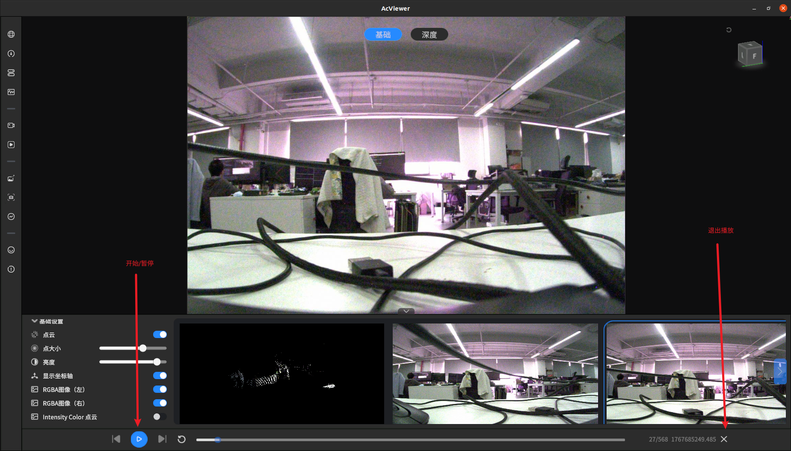

<p class="caption-text" style="text-align: center; font-size: 0.7em; color: #666;">Playback Control</p>

</div>
