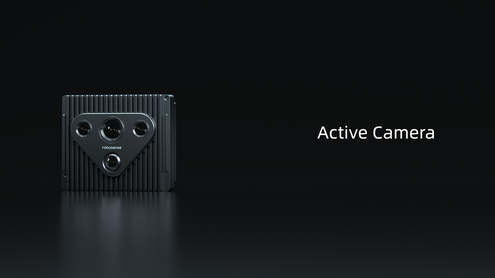

# Sensors
## Active Camera  
  

To address the challenges of environmental perception and operational cognition in robotics, RoboSense has innovatively developed the Active Camera sensor platform through multi-sensor integration. 

Significantly lowering development barriers and enhancing efficiency, the AI-Ready ecosystem-equipped Active Camera provides foundational components and advanced tools – including drivers, calibration systems, data fusion modules, SLAM capabilities, and advanced multi-modal perception algorithms. 

This empowers developers to focus on high-value tasks and functional optimization, assisting them in achieving versatile, efficient, and elegant solutions for creating robots with enhanced behavioral intelligence and expanded functional capabilities.

Its specifications are detailed in the table below:

<table class="docutils align-default" style="width: 100%; table-layout: fixed;">
    <colgroup>
        <col style="width: 20%;">
        <col style="width: 30%;">
        <col style="width: 20%;">
        <col style="width: 30%;">
    </colgroup>
    <thead>
        <tr class="row-odd centered-table-text">
            <th class="head" colspan=4>Active Camera Specifications Table</th>
        </tr>
        <tr class="row-odd centered-table-text">
            <th class="head" colspan=4>Lidar</th>
        </tr>
    </thead>
    <tbody>
        <tr class="row-even centered-table-text">
            <td>Ranging Principle</td>
            <td>TOF (Time of Flight)</td>
            <td>Horizontal FOV</td>
            <td>120°</td>
        </tr>
        <tr class="row-odd centered-table-text">
            <td>Laser Wavelength</td>
            <td>940nm</td>
            <td>Vertical FOV</td>
            <td>60°</td>
        </tr>
        <tr class="row-even centered-table-text">
            <td>Laser Safety Class</td>
            <td>Class 1 (Eye Safe)</td>
            <td>Horizontal Resolution</td>
            <td rowspan=2>Average 0.625°</td>
        </tr>
        <tr class="row-odd centered-table-text">
            <td>Ranging Capability</td>
            <td>20m@10% Reflectivity</td>
            <td>Vertical Resolution</td>
        </tr>
        <tr class="row-even centered-table-text">
            <td>Blind Zone</td>
            <td>0.1m@90% Reflectivity</td>
            <td>Accuracy (Typical)</td>
            <td>±3cm@1σ (Indoor) ±5cm@1σ (Outdoor)</td>
        </tr>
        <tr class="row-odd centered-table-text">
            <td>Points per Second</td>
            <td>~173333 points/sec</td>
            <td>Frame Rate</td>
            <td>10 Hz</td>
        </tr>
        <tr class="row-even">
            <th class="head" colspan=4>RGB Camera</th>
        </tr>
        <tr class="row-odd centered-table-text">
            <td>Shutter Type</td>
            <td>Rolling Shutter</td>
            <td>Horizontal FOV</td>
            <td>144°</td>
        </tr>
        <tr class="row-even centered-table-text">
            <td>CIS Output Format</td>
            <td>NV12, RGB24</td>
            <td>Vertical FOV</td>
            <td>79°</td>
        </tr>
        <tr class="row-odd centered-table-text">
            <td>Frame Rate</td>
            <td>30 Hz</td>
            <td>Resolution</td>
            <td>1920*1080</td>
        </tr>
        <tr class="row-even">
            <th class="head" colspan=4>IMU</th>
        </tr>
        <tr class="row-odd centered-table-text">
            <td>Degrees of Freedom</td>
            <td>6-Axis Data Output</td>
            <td>Gyroscope</td>
            <td>±500dps</td>
        </tr>
        <tr class="row-even centered-table-text">
            <td>Accelerometer</td>
            <td>±4g</td>
            <td>Data Frequency</td>
            <td>500Hz (Adjustable)</td>
        </tr>
        <tr class="row-odd">
            <th class="head" colspan=4>Overall Unit Specifications</th>
        </tr>
        <tr class="row-even centered-table-text">
            <td>Form Factor</td>
            <td>Standard Probe Module</td>
            <td>Power Consumption</td>
            <td>14W (Typical)</td>
        </tr>
        <tr class="row-odd centered-table-text">
            <td>Operating Temperature</td>
            <td>-20°C~ +60°C</td>
            <td>Protection Rating</td>
            <td>IP54</td>
        </tr>
        <tr class="row-even centered-table-text">
            <td>Data Interface</td>
            <td>USB 3.2 Gen1</td>
            <td>Power Interface</td>
            <td>DC</td>
        </tr>
        <tr class="row-odd centered-table-text">
            <td>Dimensions</td>
            <td>95mm*42.6mm*80mm</td>
            <td></td>
            <td></td>
        </tr>
    </tbody>
</table> 

[Click to learn more details](https://www.robosense.ai/en/rslidar/AC1)
