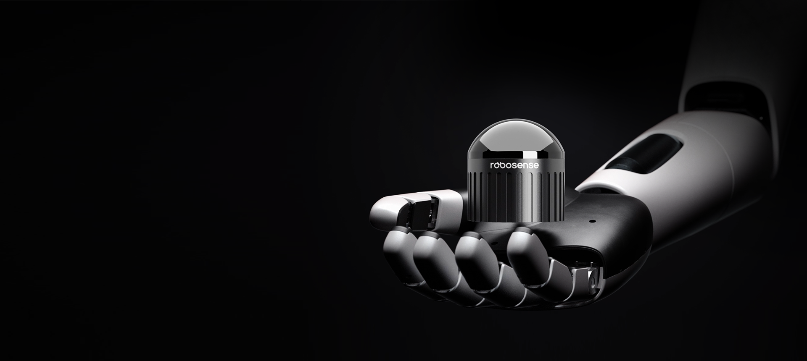
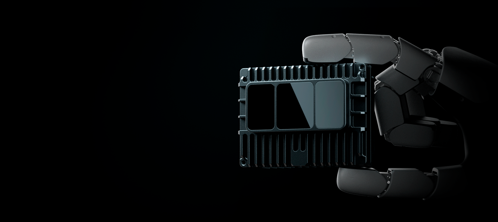

# Sensors
## Active Camera  
  

## Airy

Targeting the robotics market, RoboSense introduces a new generation of hemispherical mechanical LiDAR, emphasizing miniaturization and lightweight features. It fully considers the perception needs of mobile robots for navigation and obstacle avoidance. Through a unique optomechanical system design, it provides an ultra-wide hemispherical FOV of 360° horizontally and 90° vertically in a ping-pong ball-sized package, with a maximum detection range of 60m, supporting 192 lines, and compatible with both indoor and outdoor scenes, empowering robots to enter a new era of full-scene intelligence.  
Click to learn more：[Airy](https://www.robosense.ai/rslidar/Airy)

## E1R

Based on a mass-produced automotive-grade LiDAR platform, RoboSense designed a flat-window pure solid-state LiDAR for the robotics market. It has no moving parts internally, balancing detection performance, cost advantages, and reliability. It features an ultra-wide FOV of 120° horizontally and 90° vertically, with a maximum detection range of 75m, supporting 144 lines, enabling robots to handle harsh environments such as rain and dust with ease.  
Click to learn more：[E1R](https://www.robosense.ai/rslidar/E1R)