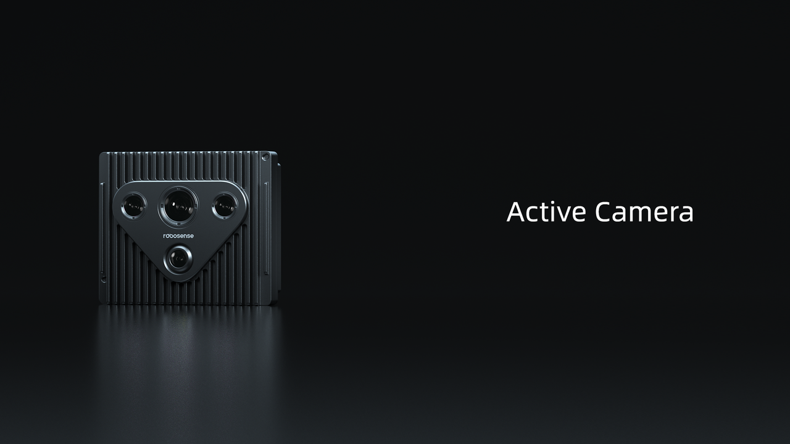
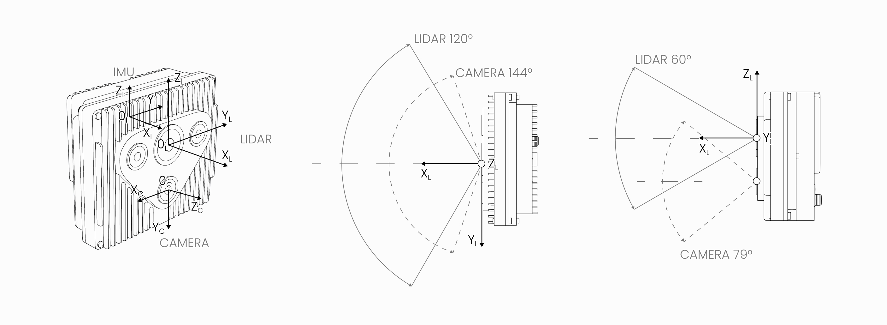
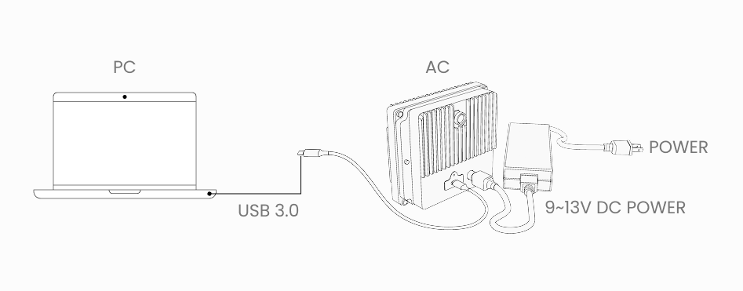
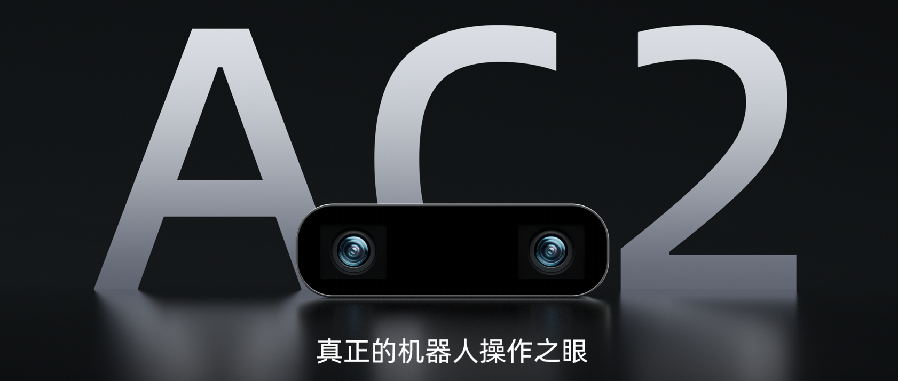
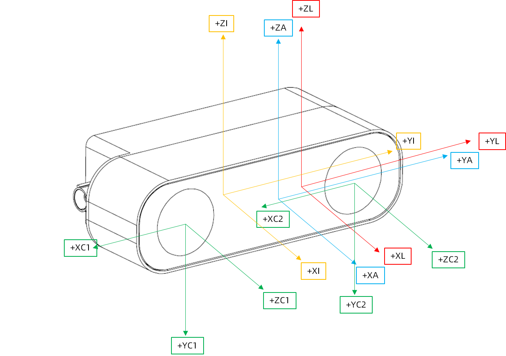
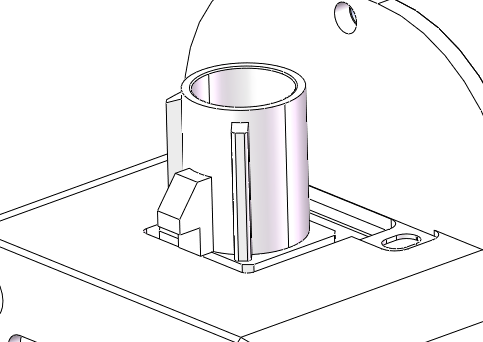
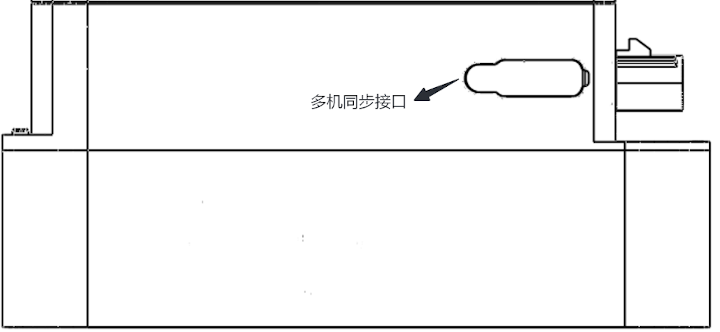
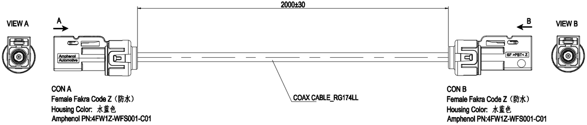
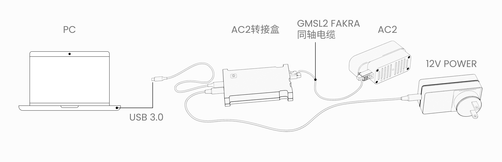
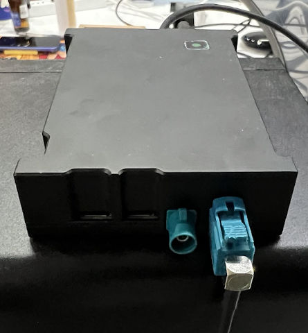

# Active Camera

To address the complex challenges of environmental perception and manipulation cognition in robotics, RoboSense has developed Active Camera, an innovative sensor platform based on multi-sensor integration. 

Designed to significantly lower the barrier to entry and accelerate development workflows, the platform enables developers to focus on high-value tasks and core feature optimization. Active Camera features a comprehensive AI-Ready Ecosystem that delivers both foundational infrastructure and advanced toolkits. 

By providing out-of-the-box components such as hardware drivers, calibration utilities, data fusion pipelines, SLAM capabilities, and high-level multimodal perception algorithms, this robust architecture empowers developers to implement versatile, efficient, and elegant solutions, ultimately facilitating the creation of highly intelligent and feature-rich robots.

The Active Camera series currently consists of two models: AC1 and AC2.

## AC1

The AC1 integrates a monocular RGB camera, a LiDAR, and an IMU sensor. 

Designed to cover short-to-medium range indoor and outdoor scenarios, it is capable of handling the majority of standard robotic tasks, including environmental perception, localization and navigation, and object detection.

  

### Specifications

<table class="docutils align-default" style="width: 100%; table-layout: fixed;">
    <colgroup>
        <col style="width: 20%;">
        <col style="width: 30%;">
        <col style="width: 20%;">
        <col style="width: 30%;">
    </colgroup>
    <thead>
        <tr class="row-odd centered-table-text">
            <th class="head" colspan=4>Active Camera Specifications Table</th>
        </tr>
        <tr class="row-odd centered-table-text">
            <th class="head" colspan=4>Lidar</th>
        </tr>
    </thead>
    <tbody>
        <tr class="row-even centered-table-text">
            <td>Ranging Principle</td>
            <td>TOF (Time of Flight)</td>
            <td>Horizontal FOV</td>
            <td>120°</td>
        </tr>
        <tr class="row-odd centered-table-text">
            <td>Laser Wavelength</td>
            <td>940nm</td>
            <td>Vertical FOV</td>
            <td>60°</td>
        </tr>
        <tr class="row-even centered-table-text">
            <td>Laser Safety Class</td>
            <td>Class 1 (Eye Safe)</td>
            <td>Horizontal Resolution</td>
            <td rowspan=2>Average 0.625°</td>
        </tr>
        <tr class="row-odd centered-table-text">
            <td>Ranging Capability</td>
            <td>20m@10% Reflectivity</td>
            <td>Vertical Resolution</td>
        </tr>
        <tr class="row-even centered-table-text">
            <td>Blind Zone</td>
            <td>0.1m@90% Reflectivity</td>
            <td>Accuracy (Typical)</td>
            <td>±3cm@1σ (Indoor) ±5cm@1σ (Outdoor)</td>
        </tr>
        <tr class="row-odd centered-table-text">
            <td>Points per Second</td>
            <td>~173333 points/sec</td>
            <td>Frame Rate</td>
            <td>10 Hz</td>
        </tr>
        <tr class="row-even">
            <th class="head" colspan=4>RGB Camera</th>
        </tr>
        <tr class="row-odd centered-table-text">
            <td>Shutter Type</td>
            <td>Rolling Shutter</td>
            <td>Horizontal FOV</td>
            <td>144°</td>
        </tr>
        <tr class="row-even centered-table-text">
            <td>CIS Output Format</td>
            <td>NV12, RGB24</td>
            <td>Vertical FOV</td>
            <td>78°</td>
        </tr>
        <tr class="row-odd centered-table-text">
            <td>Frame Rate</td>
            <td>30 Hz</td>
            <td>Resolution</td>
            <td>1920*1080</td>
        </tr>
        <tr class="row-even">
            <th class="head" colspan=4>IMU</th>
        </tr>
        <tr class="row-odd centered-table-text">
            <td>Degrees of Freedom</td>
            <td>6-Axis Data Output</td>
            <td>Gyroscope</td>
            <td>±2000dps</td>
        </tr>
        <tr class="row-even centered-table-text">
            <td>Accelerometer</td>
            <td>±16g</td>
            <td>Data Frequency</td>
            <td>200Hz (Adjustable)</td>
        </tr>
        <tr class="row-odd">
            <th class="head" colspan=4>Overall Unit Specifications</th>
        </tr>
        <tr class="row-even centered-table-text">
            <td>Form Factor</td>
            <td>Standard Probe Module</td>
            <td>Power Consumption</td>
            <td>12.6W (Typical)</td>
        </tr>
        <tr class="row-odd centered-table-text">
            <td>Operating Temperature</td>
            <td>-20°C ~ +60°C</td>
            <td>Storage Temperature</td>
            <td>-20°C ~ +70°C</td>
        </tr>
        <tr class="row-odd centered-table-text">
            <td>Protection Rating</td>
            <td>IP54</td>
            <td>Weight</td>
            <td>400g ± 10%</td>
        </tr>
        <tr class="row-even centered-table-text">
            <td>Data Interface</td>
            <td>USB 3.2 Gen1</td>
            <td>Power Interface</td>
            <td>DC</td>
        </tr>
        <tr class="row-odd centered-table-text">
            <td>Dimensions</td>
            <td>95mm*42.6mm*80mm</td>
            <td></td>
            <td></td>
        </tr>
    </tbody>
</table> 

### Coordinate Systems

In practical applications, data from various sensors in the Active Camera is required.  
The coordinate systems of these sensors are defined as follows:

- The coordinate system of the LiDAR sensor is denoted as $O_L−X_LY_LZ_L$ .
- The coordinate system of the camera sensor is denoted as $O_C−X_CY_CZ_C$ .
- The coordinate system of the IMU sensor is denoted as $O_I−X_IY_IZ_I$ .
- The AC coordinate system $O−XYZ$ is defined as identical to the LiDAR coordinate system, $O_L−X_LY_LZ_L$ .

The relationships between these coordinate systems are illustrated in the figure below:
  

- The origin of the LiDAR coordinate system $O_L$ in the AC coordinate system $O−XYZ$ is at $(0,0,0)$ (unit: mm).
- The origin of the camera coordinate system $O_C$ in the AC coordinate system $O−XYZ$ is at $(4.3,0,−26.9)$ (unit: mm).
- The origin of the IMU coordinate system $O_I$ in the AC coordinate system $O−XYZ$ is at $(−10.6,−9.9,15.5)$ (unit: mm).

## Computing Platforms

The table below lists some computing platforms compatible with Active Camera, along with the supported SDK applications and system images. 

These system images include the dependencies required for compiling and running the supported SDKs.

<table class="docutils align-default">
    <tr class="centered-table-text">
        <td style="font-weight: bold;" colspan="2">Computing Platform</td>
        <td style="font-weight: bold;">General x86  Architecture Computers</td>
        <td style="font-weight: bold;">Radxa ROCK5B+</td>
        <td style="font-weight: bold;">OrangePi 5 Ultra</td>
        <td style="font-weight: bold;">NVIDIA Jetson  Orin Nano Super</td>
        <td style="font-weight: bold;">NVIDIA Jetson AGX Orin</td>
        <td style="font-weight: bold;">D-Robotics RDK X5</td>
    </tr>
    <tr class="centered-table-text">
        <td colspan="2">SOC</td>
        <td>-</td>
        <td>Rockchip RK3588</td>
        <td>Rockchip RK3588</td>
        <td>Jetson Orin Nano 8GB module</td>
        <td>Jetson Orin</td>
        <td>Sunrise 5</td>
    </tr>
    <tr class="centered-table-text">
        <td colspan="2">CPU</td>
        <td>Intel® Xeon(R)  Gold 6230R CPU @  2.10GHz x 104</td>
        <td>8-Core 64-bit Processor  4 x Cortex-A76@2.4GHz  4 x Cortex-A55@1.8GHz</td>
        <td>8-Core 64-bit Processor  4 x Cortex-A76@2.4GHz  4 x Cortex-A55@1.8GHz</td>
        <td>6 x Cortex-A78@2.4GHz</td>
        <td>12 x Cortex-A78AE@2.2GHz</td>
        <td>8 x Cortex-A55@1.5GHz</td>
    </tr>
    <tr class="centered-table-text">
        <td colspan="2">MEM</td>
        <td>64 GB</td>
        <td>16 GB LPDDR5</td>
        <td>16 GB LPDDR5</td>
        <td>8 GB LPDDR5</td>
        <td>64 GB LPDDR5</td>
        <td>8 GB LPDDR4</td>
    </tr>
    <tr class="centered-table-text">
        <td colspan="2">AI Computing Power</td>
        <td>NVIDIA A40  (299.3 TOPS@INT8 GPU)</td>
        <td>6 TOPS@INT8 NPU</td>
        <td>6 TOPS@INT8 NPU</td>
        <td>67 TOPS@INT8 GPU</td>
        <td>275 TOPS@INT8 GPU</td>
        <td>10 TOPS@INT8 BPU</td>
    </tr>
    <tr class="centered-table-text">
        <td rowspan="12">Supported   SDKs 1 </td>
    </tr>
    <tr class="centered-table-text">
        <td>Driver</td>
        <td>●</td>
        <td>●</td>
        <td>●</td>
        <td>●</td>
        <td>●</td>
        <td>●</td>
    </tr>
    <tr class="centered-table-text">
        <td>Data Acquisition</td>
        <td>●</td>
        <td>●</td>
        <td>●</td>
        <td>●</td>
        <td>●</td>
        <td>●</td>
    </tr>
    <tr class="centered-table-text">
        <td>Monitoring</td>
        <td>●</td>
        <td>●</td>
        <td>●</td>
        <td>●</td>
        <td>●</td>
        <td>●</td>
    </tr>
    <tr class="centered-table-text">
        <td>Calibration</td>
        <td>●</td>
        <td>●</td>
        <td>●</td>
        <td>●</td>
        <td>●</td>
        <td>●</td>
    </tr>
    <tr class="centered-table-text">
        <td>Point Cloud & Vision Fusion</td>
        <td>●</td>
        <td>●</td>
        <td>●</td>
        <td>●</td>
        <td>●</td>
        <td>●</td>
    </tr>
    <tr class="centered-table-text">
        <td>Localization</td>
        <td>●</td>
        <td>●</td>
        <td>●</td>
        <td>●</td>
        <td>●</td>
        <td>●</td>
    </tr>
    <tr class="centered-table-text">
        <td>SLAM</td>
        <td>●</td>
        <td>●</td>
        <td>●</td>
        <td>●</td>
        <td>●</td>
        <td>●</td>
    </tr>
    <tr class="centered-table-text">
        <td>3D Gaussian Splatting</td>
        <td>●</td>
        <td>○</td>
        <td>○</td>
        <td>○</td>
        <td>●</td>
        <td>○</td>
    </tr>
    <tr class="centered-table-text">
        <td>Dense Depth Estimation</td>
        <td>●</td>
        <td>●</td>
        <td>●</td>
        <td>●</td>
        <td>●</td>
        <td>○</td>
    </tr>
    <tr class="centered-table-text">
        <td>Object Detection & Recognition</td>
        <td>●</td>
        <td>●</td>
        <td>●</td>
        <td>●</td>
        <td>●</td>
        <td>●</td>
    </tr>
    <tr class="centered-table-text">
        <td>Semantic Segmentation</td>
        <td>●</td>
        <td>●</td>
        <td>●</td>
        <td>●</td>
        <td>●</td>
        <td>●</td>
    </tr>
    <tr class="centered-table-text">
        <td colspan="2">System image/ SDK Environment Container 2 </td>
        <td>
            <a href="https://github.com/RoboSense-Robotics/ros2_ac_sdk_infra/tree/main/tools/cross_compilation">
                SDK Environment Container
            </a>
        </td>
        <td>
            <a href="https://github.com/RoboSense-Robotics/robosense_ac_ros2_sdk_infra/blob/main/tools/system_image/Radxa_Image_Readme.md">
                System image installation description
            </a>
        </td>
        <td>-</td>
        <td>
            <a href="https://github.com/RoboSense-Robotics/robosense_ac_ros2_sdk_infra/blob/main/tools/system_image/Orin_Nano_Image_Readme.md">
                System image installation description
            </a>
        </td>
        <td>-</td>
        <td>
            <a href="https://github.com/RoboSense-Robotics/robosense_ac_ros2_sdk_infra/blob/main/tools/system_image/RDK_X5_Image_Readme.md">
                System image installation description
            </a>
        </td>
    </tr>
</table>

1 ● (Solid Circle): Indicates support for a specific feature or functionality.   &nbsp; ○ (Hollow Circle): Indicates no support for a specific feature or functionality.

2 The Active Camera SDK provides containers and system images on different platforms. The SDK container provides Docker containers for cross-platform compilation and local compilation environments, including container management, image management and automatic environment Settings. And the system image comes preinstalled with third-party dependencies for ros2 Humble and SDK.

### Hardware Connection

Data transmission for the AC1 is routed via a USB 3.0 interface. Connect the device to the host computer as illustrated in the following diagram.

## AC2

The AC2 is a perception solution within the Active Camera series, specifically engineered for robotic manipulation applications. 
As the industry's first advanced sensor system to integrate an all-solid-state dToF LiDAR, a stereo RGB camera, and an IMU, the AC2 flexibly outputs fused or independent depth, image, and motion posture data. 
It is widely utilized in fields such as embodied AI, robotic arms, industrial equipment, and digital twin modeling, satisfying requirements for motion capture, object detection, pose estimation, 3D modeling, and mapping/localization (SLAM) in both indoor and outdoor environments. 
Powered by RoboSense's proprietary architecture, the AC2 features an industry-leading ultra-high accuracy of ±5 mm, an ultra-wide FOV of 120° × 90°, and robust interference resistance. 
It effectively suppresses crosstalk, overexposure, and missed detections caused by highly reflective materials, maintaining stable performance in complex scenarios such as strong light, low light, and alternating light/dark conditions. 
Furthermore, through its robust AI-Ready ecosystem, the AC2 provides developers with comprehensive toolkits and algorithm resources to solve manipulation cognition challenges, enhance development efficiency, and accelerate the commercialization of innovative products.

### Specifications

<table class="docutils align-default" style="width: 100%; table-layout: fixed;">
    <colgroup>
        <col style="width: 20%;">
        <col style="width: 30%;">
        <col style="width: 20%;">
        <col style="width: 30%;">
    </colgroup>
    <thead>
        <tr class="row-odd centered-table-text">
            <th class="head" colspan=4>Specifications of AC2</th>
        </tr>
        <tr class="row-odd centered-table-text">
            <th class="head" colspan=4>LiDAR</th>
        </tr>
    </thead>
    <tbody>
        <tr class="row-even centered-table-text">
            <td>Ranging Principle</td>
            <td>Time of Flight (ToF)</td>
            <td>Horizontal FOV</td>
            <td>120°</td>
        </tr>
        <tr class="row-odd centered-table-text">
            <td>Laser Wavelength</td>
            <td>905nm</td>
            <td>Vertical FOV</td>
            <td>90°</td>
        </tr>
        <tr class="row-even centered-table-text">
            <td>Laser Safety Class</td>
            <td>Class1 Eye Safe</td>
            <td>Horizontal Resolution</td>
            <td>0.5°</td>
        </tr>
        <tr class="row-odd centered-table-text">
            <td>Detection Range</td>
            <td>Indoor: 8m   Outdoor: 5m 10%ref @100klux sunlight</td>
            <td>Vertical Resolution</td>
            <td>0.5°</td>
        </tr>
        <tr class="row-even centered-table-text">
            <td>Blind Zone</td>
            <td>0.1m</td>
            <td>Precision（Typical）</td>
            <td>5mm</td>
        </tr>
        <tr class="row-odd centered-table-text">
            <td>Points per Second</td>
            <td>432000</td>
            <td>Frame Rate</td>
            <td>10Hz</td>
        </tr>
        <tr class="row-even">
            <th class="head" colspan=4>Stereo Camera</th>
        </tr>
        <tr class="row-odd centered-table-text">
            <td>Shutter Type</td>
            <td>Global Shutter</td>
            <td>Horizontal FOV</td>
            <td>120°</td>
        </tr>
        <tr class="row-even centered-table-text">
            <td>Stereo Baseline</td>
            <td>65mm</td>
            <td>Vertical FOV</td>
            <td>90°</td>
        </tr>
        <tr class="row-odd centered-table-text">
            <td>Frame Rate</td>
            <td>10Hz/30Hz</td>
            <td>Resolution</td>
            <td>1600*1200</td>
        </tr>
        <tr class="row-even">
            <th class="head" colspan=4>IMU</th>
        </tr>
        <tr class="row-odd centered-table-text">
            <td>Degree of Freedom</td>
            <td>6 Axis output</td>
            <td>Gyroscope</td>
            <td>±500dps</td>
        </tr>
        <tr class="row-even centered-table-text">
            <td>Accelerometer</td>
            <td>±4g</td>
            <td>Frame Rate</td>
            <td>500Hz(Configurable)</td>
        </tr>
        <tr class="row-odd">
            <th class="head" colspan=4>General</th>
        </tr>
        <tr class="row-even centered-table-text">
            <td>Form Factor</td>
            <td>Standard Sensor Module</td>
            <td>Power Consumption</td>
            <td><8W</td>
        </tr>
        <tr class="row-odd centered-table-text">
            <td>Operating Temperature</td>
            <td>-10°C ~ +55°C</td>
            <td>Storage Temperature</td>
            <td>-20°C ~ +70°C</td>
        </tr>
        <tr class="row-odd centered-table-text">
            <td>IP Rating</td>
            <td>IP65</td>
            <td>Weight</td>
            <td><240g</td>
        </tr>
        <tr class="row-even centered-table-text">
            <td>Data Interface</td>
            <td>Fakra Code Z Male(GMSL2)</td>
            <td>Power Interface</td>
            <td>Fakra Code Z Male(POC)</td>
        </tr>
        <tr class="row-odd centered-table-text">
            <td>Dimensions</td>
            <td>102mm*32mm*45mm（Length*Height*Width）</td>
            <td>Synchronization Accuracy</td>
            <td>Hardware-level synchronization between IMU, Stereo and ToF, with sync accuracy < 1ms</td>
        </tr>
    </tbody>
</table> 

### Coordinate Systems

For practical applications, processing and fusing data from the various sensors integrated into the AC2 requires a unified spatial reference. The coordinate systems (frames) for each sensor are defined as follows:

- LiDAR frame : $O_L-X_LY_LZ_L$
- Camera frames : $O_{C1}-X_{C1}Y_{C1}Z_{C1}$ 、$O_{C2}-X_{C2}Y_{C2}Z_{C2}$
- IMU frame : $O_I-X_IY_IZ_I$
- AC2 Body frame : $O_A-X_AY_AZ_A$

The spatial relationships between these coordinate systems are illustrated in the figure below:

The origin of the AC2 Base Coordinate System ($$O_A - X_A Y_A Z_A$$) is defined at the geometric center of the product's optical window surface (aligned with the length and width axes).

The coordinates of each sensor's origin relative to the AC2 base coordinate system $O_A-X_AY_AZ_A$ are as follows (Unit: mm):
- LiDAR Origin ($O_L$): (0, 3.7, 0)
- Camera 1 Origin ($O_{C1}$): (0, -31.5, 0)
- Camera 2 Origin ($O_{C2}$): (0, 31.5, 0)
- IMU Origin ($O_I$): (-30.2, -14.5, 6.2)

### Hardware Interfaces and Connections
#### Hardware Interfaces
- Data Interface: Fakra Code Z (Male). The interface protocol is defined as GMSL2. This port also functions as the power supply interface, meaning the AC2 utilizes PoC (Power over Coax) for power delivery.

- Time-Sync Interface (Multi-Device Synchronization): 8-pin connector with a 0.8 mm pin pitch.

- FAKRA Coaxial Cable: Terminated with FAKRA Code Z (Female) connectors on both ends.

#### Hardware Connection

The AC2 requires a dedicated adapter box for operation. Connect the AC2 to the adapter box, and subsequently connect the adapter box to the host computer, as illustrated in the following diagram.

Note:
Ensure that the GMSL cable is connected to the port on the right side of the adapter box, as shown in the image below.

<a href="https://www.robosense.ai/en/rslidar/AC1" class="rounded-button" target="_blank">Learn More</a>
